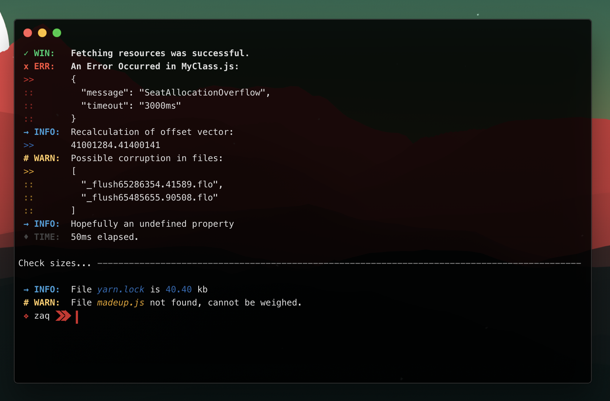

# zaq

Did we need another Node-based logging utility? I dunno. Did we get one? *Yeah.*

Have you met `zaq`? He's based on practicality and performance. What are you doing? *Shake his hand!*

License: **MIT**


## Installation
You know the drill. Install via NPM:
```bash
npm install zaq
```
Require in your Node project:
```js
var zaq = require('zaq');
```



## Logging API

### `.log( message )`
Pass a `message` to `zaq.log()` to have it printed to the console. *Yes, this is an alias of `console.log()`.*


### `.win( message )`
Pass a success `message` to `zaq.win()` to display it in the win/success style: following a green checkmark and 'WIN:' prefix.

### `.err( message )`
Pass an error `message` to `zaq.err()` to display it in the error style: following a red 'X' and 'ERR:' prefix.

### `.info( message )`
Pass an informational `message` to `zaq.info()` to display it in the info style: following a blue arrow and 'INFO:' prefix.

### `.warn( message )`
Pass a warning `message` to `zaq.warn()` to display it in the warning style: following a yellow hash and 'WARN:' prefix.

### `.time( message )`
Pass a timing `message` to `zaq.time()` to display it in the timing style: following a grey diamond and 'TIME:' prefix.

### `.pretty( obj )`
Pass an `array` or `object` to `zaq.pretty()` to get returned a `JSON.stringify()` string version that's properly spaced and indented. Used internally for `.json()` calls.

#### ...and much more to be documented.
